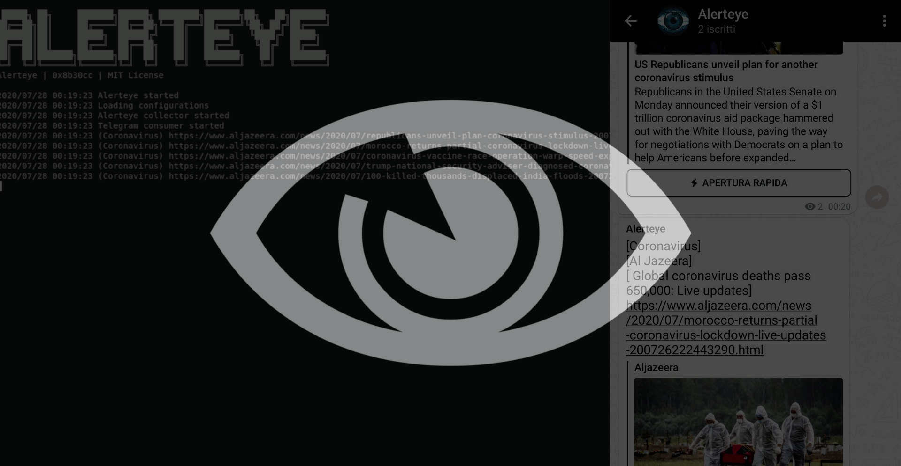

# Alerteye



Alerteye is a simple and lightweight RSS reader that sends alerts about topics you are interested in via a Telegram Bot. I did this project for myself in order to solve the following problems: 

* Start learning Go.
* Get updates only on topics that I follow.
* Make my Raspberry Pi do something.

## Compile
Compile for the current system
```
git clone https://github.com/0x8b30cc/Alerteye
cd Alerteye
make
```
Cross compile for raspberry pi

```
git clone https://github.com/0x8b30cc/Alerteye
cd Alerteye
sudo apt install gcc-arm-linux-gnueabi
make rpi
```

## Usage

Start alerteye daemon (in bin folder)
```
./alerteye
```

after the first execution a data folder is created with the following structure:

```
data
 |---alerteye.db
 |---alerteye.log
 |---config.json
```

Configure alerteye with config.json file:

```json
{
    "telegram_bot_token": "xxxx",
	"telegram_chat_id": "xxxx",
	"collector_time": 60,
	"send_time": 30,
	"topics": [
		{
			"name": "Coronavirus",
			"keywords": [
				"Coronavirus",
				"Covid-19"
			]
		}
	],
	"sources": [
		{
			"name": "Al Jazeera",
			"url": "https://www.aljazeera.com/xml/rss/all.xml"
		}
	]
}
```

Get your chat id with the following URL:

```
https://api.telegram.org/bot<bot-token>/getUpdates
```

## License

The MIT License (MIT)

Copyright (c) 2020 Davide Pataracchia

Permission is hereby granted, free of charge, to any person
obtaining a copy of this software and associated documentation
files (the "Software"), to deal in the Software without
restriction, including without limitation the rights to use,
copy, modify, merge, publish, distribute, sublicense, and/or sell
copies of the Software, and to permit persons to whom the
Software is furnished to do so, subject to the following
conditions:

The above copyright notice and this permission notice shall be
included in all copies or substantial portions of the Software.

THE SOFTWARE IS PROVIDED "AS IS", WITHOUT WARRANTY OF ANY KIND,
EXPRESS OR IMPLIED, INCLUDING BUT NOT LIMITED TO THE WARRANTIES
OF MERCHANTABILITY, FITNESS FOR A PARTICULAR PURPOSE AND
NONINFRINGEMENT. IN NO EVENT SHALL THE AUTHORS OR COPYRIGHT
HOLDERS BE LIABLE FOR ANY CLAIM, DAMAGES OR OTHER LIABILITY,
WHETHER IN AN ACTION OF CONTRACT, TORT OR OTHERWISE, ARISING
FROM, OUT OF OR IN CONNECTION WITH THE SOFTWARE OR THE USE OR
OTHER DEALINGS IN THE SOFTWARE.